# MMORPG Abusing Detection

## 1. 개요

### 1.1 내용
- 특정 게임에서 골드를 파밍하는 어뷰저를 판별해내는 룰 혹은 머신러닝 알고리즘 구현

### 1.2 참고사항
- 어뷰저란? 기획적으로 의도하지 않은 방식으로 게임 정보를 대량 획득하거나 도움을 주는 유저

### 1.3 데이터 설명
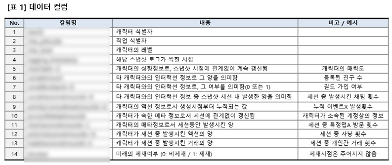

## 2. 탐색적 데이터 분석(EDA)

### 2.1. 문제 목적
- 골드를 파밍하는 어뷰저를 정확하게 판별하는 것으로 테스트셋 44,736건에 대하여 제재 대상은 1, 비제재 대상은 0으로 함.

- 어뷰저라 판단할 수 있을 특성들에 대하여 아래 [표 2]과 같이 생각해 봄

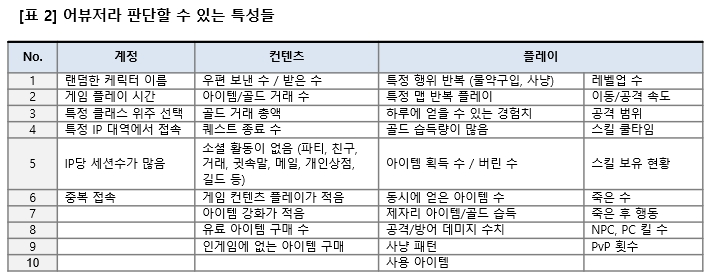

### 2.2. 변수 탐색
- [그림 1]을 보면 학습셋 104,399개 테스트셋 44,736개로 7:3의 비율로 나타남
- 컬럼 중 logging_timestamp만 str로 구성되어 있으며 모두 int형태의 변수로 되어있음

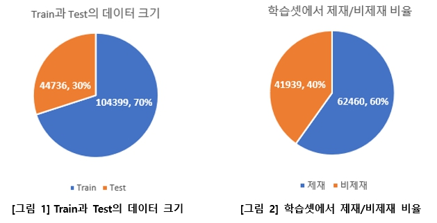

### 2.3. 시각화 – 피어슨 상관분석(Pearson Correlation Analysis)
- 피어슨 상관관계를 통하여 각 변수들간의 관계를 알 수 있음.
- 모든 데이터가 ‘continuous’해야 하며 logging_timestamp는 우선 제거하고 분석함 
    - (-1 : 음의 상관관계 / 0 : 상관없음 / 1 : 양의 상관관계)

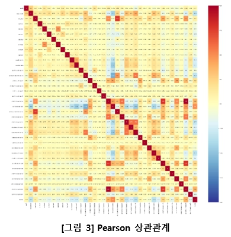

### 2.4 시각화 – 미래의 제재여부(blocked), 캐릭터 식별자(newID)
- 학습용 데이터셋에는 44개의 컬럼으로 이루어져 있고, 테스트용 데이터셋은 ‘blocked’ 값을 제외한 43개의 컬럼으로 이루어져 있음.
- [그림 2]에서 보는 것처럼 테스트셋에 대하여 제재 대상은 62,460건 비제재 대상은 41,939건으로 6:4의 비율로 나타남.
- newID 기준
    - 학습셋: 전체 10,441개 (제재: 6,246/비제재: 4,195)
    - 테스트셋: 전체 4,475개 (제재/비제재 알 수 없음)
- 대부분의 데이터가 하나의 newID 당 10개의 스냅샷 로그가 남아 있지만 아래 [표 3]에서의 해당 newID들은 10개 미만의 스냅샷 로그를 갖고 있음.

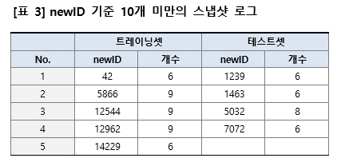

### 2.5. 시각화 – 직업식별자(char_jobcode)
- 전체(게임 전체직업 개수 알 수 없음) 중 165개의 직업 종류
- 제재 대상은 5개의 직업만 플레이하였고 비제재 대상은 165개의 직업을 플레이함
- 21, 29, 30, 31의 경우 게임 내에서 두루 인기가 좋은 직업일 것 같으나 32번의 경우 잘 이용되지 않는 직업인데 어뷰징 용도로 이용됨

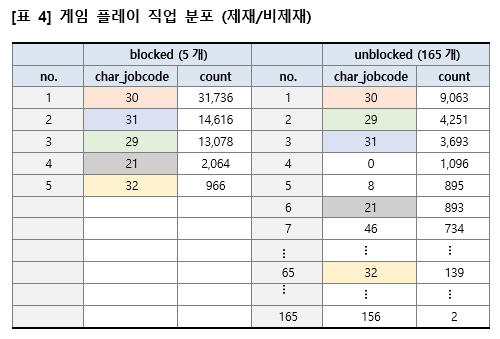

### 2.6. 시각화 – 캐릭터 레벨(char_level)
- 모든 데이터에서의 최소 레벨은 10, 최고 레벨은 159를 나타냄 (제재: 10~133/비제재: 10~159)
- 이를 보아 0~10레벨은 튜토리얼 등을 진행하며 10부터 필드로 진출하는 방식을 것으로 예상함

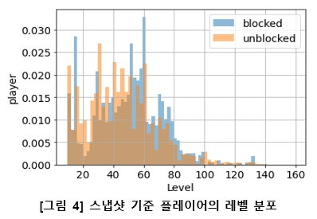

- 다음으로 char_jobcode에 따른 유저 레벨(최소/최대) 을 보니 각 직업이 갖을 수 있는 제한범위가 있음
- 최소 레벨 기준 10, 30, 60, 100 에서의 분포가 나타나는 것으로 보아 10, 30, 60, 100에서 직업특성화, 전직, 승급 등의 캐릭터직업의 변화가 나타나는 것으로 예상됨
> ⚠️ _**한가지 특이점은 10부터 최대 133까지 직업의 변화 없이 하나의 직업으로만 플레이한 유저도 상당 수 존재함**_

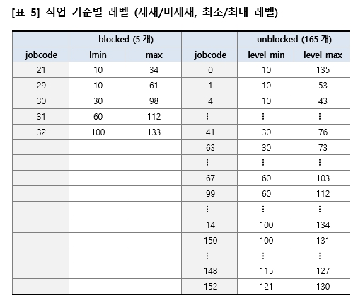

- 캐릭터의 레벨 변화를 알아보기 위해 [그림 5]와 같이 스냅샷 로그 기준으로 마지막 타임의 레벨과 첫 타임의 레벨과 차이를 비교해 보았음
- 하지만, 이것은 잘못된 비교임. 타임스탬프 구간이 짧을 수도 있고 길 수도 있어서 정확한 비교 방법이 될 수 없음

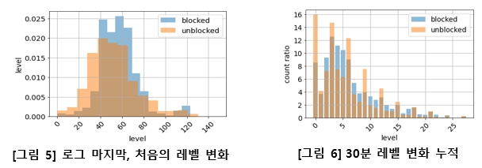

- 방법을 조금 바꿔서 스냅샷 로그에서 연속되는 타임스탬프(30분) 간격이 있을 경우 30분간 업한 레벨 값을 확인해 보았음
- [그림 6]에서 볼 수 있듯이 30분 간격을 넘는 경우는 무시하고, 다시 그 다음 로그와 30분 간격으로 비교해 보았음
- 하지만 단순 수치상 변화만 보기에는 레벨 후반부로 갈수록 더 많은 경험치를 얻어야 하기에 상승폭이 줄어듦. 레벨 구간별 가중치 등을 주는 것도 방법으로 생각됨

### 2.7. 시각화 - 해당 스냅샷 로그가 찍힌 시점(logging_timestamp)
- 테스트셋의 스냅샷 로그 기간은 2017-06-09 부터 2017-06-29 까지 21간의 데이터로 구성됨

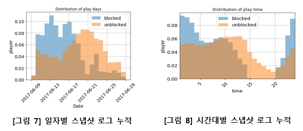

- 캐럭터 기준 10개씩의 기록구간을 살펴보면 30분 간격으로 스냅샷 로그가 남으며, 4시간 30분동안 연속으로 로그가 남은 캐릭터가 있는 반면 17일에 걸쳐 10개의 로그가 남은 경우도 있음
- Blocked
    - 가장 짧은 구간: 0 days 04:30:11.320154 / 가장 긴 구간: 2 days 19:06:20.131132
- Unblocked
    - 가장 짧은 구간: 0 days 04:30:12.032881 / 가장 긴 구간: 17 days 21:03:52.563561

- 제재 유저들은 밤, 시간대에 많이 플레이하는 경향이 있음
> ⚠️ _**주어진 데이터에서 캐릭터별 10개씩의 스냅샷 로그가 연속적인 것인지 중간에 누락된 것들이 있는 것인지 알 수 없음**_
- [표 6]과 같이 캐릭터 별 로그 기록 구간을 확인할 수 있음.
- 제재되는 경우는 대부분이 당일에 발생하는 경우가 대부분임

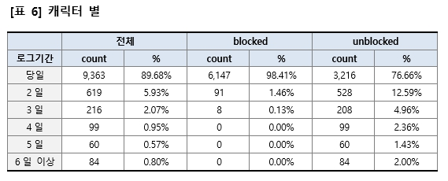

### 2.8. 결측치 확인 및 기타
- Null, Na는 존재하지 않음
- 누적 카운트가 없음 - 아래의 5개 컬럼은 누적된 데이터가 없어서 제외하여도 무방하다고 판단
    - socialBooleanB
    - accountMetaAmountA
    - charSessionAmountB
    - tradeSessionAmountC
    - tradeSessionAmountE

- 설명이 없음 – 컬럼에는 있는 데이터지만 제공받은 ReadME.txt에서는 설명이 되어 있지 않음
- 정체를 알 수 없는 데이터는 사용하지 않는 것이 맞으나 컬럼명으로 유추해보아 움직임과 메타정보과 관련된 데이터라고 추정되어 그냥 사용하기로 함
    - charSessionAmountD
    - charMoveSessionAmountA

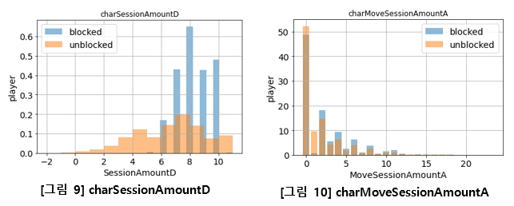

### 2.9. EDA를 통해 알아낸 것, 알아내지 못한 것
- 데이터 종류
    - 해당 로그 데이터는 XXXXX에서 서비스 중인 XXXXX의 로그로 예상됨
    - 2015-12-22에 블래스터 신규 직업이 업데이트 되고 카데나가 업데이트 되기 전의 37개의 직업이 존재할 때의 로그로 예상됨
- 레벨
    - 각각의 캐릭터마다 레벨 10, 30, 60, 100 구간마다 전직 이벤트가 있음 
- 로그
    - 로그 간격이 30분이 넘어선 31~40분 등의 경우 그 사이 재접속 한 것으로 판단됨
    - 제공되는 데이터의 10개의 로그 시점이 연속적인 것인지? 중간에 누락되는 기록이 있는지?
    - 어뷰징 중이라고 판단되는 시점에만 30분간격으로 로그 찍히는 것인지? 접속 후 매 30분 마다 기록되는 것인지?
- 제재 판단
    - 해당 로그 시점으로 어뷰징이라 판단되면 로그 앞뒤로 blocked으로 기록되는가?
    - 제공 데이터 기준으로 마지막 시점 기준으로 어뷰징이면 앞의 로그도 blocked=1으로 변하는가?
    - 제재 대상이라고 판단 되는순간부터 blocked=1으로 판단되는가?

## 3. 데이터 전처리(Data Preprocessing)

### 3.1. 교차 검증(Cross Validation)
- 주어진 테스트 데이터셋에는 제재/비제재 관련 정보가 없음. 따라서, 자체적으로 모델을 평가할만한 검증시스템이 준비되어야 함. 크게 Hold-out 방식과 k-fold 방식으로 나뉘어짐

### 3.2. 전처리 – 범주형 변수
- 주어진 데이터들이 대부분 행동기록 관찰된 현상을 수치적으로 표현한 데이터라 one-hot encoding 등의 기법이 필요없음
- 스냅샷 로그 시점(logging_timestamp)의 경우 우선은 제외하고 진행

## 4. 변수 생성(Feature Engineering)

### 4.1. 변수의 사칙연산
- 차원이 증가함에 따라 모델의 성능이 안 좋아지는 현상이 있음
- 관련이 있는 변수들을 더하거나 곱하는 등의 합치는 방법이 있음
    - tradeSessionAmountA, tradeSessionAmountB, tradeSessionAmountD
        - tradeSessionAmount으로 합침
    - logging_timestamp에서 시간단위로 새로운 컬럼 추가
    - charSessionAmountC, actionSessionAmountM 제거
    - socialSessionAmountB

### 4.2. 변화량 (레벨, 스킬사용 횟수 등)
- 통상적인 범주내의 경험치 습득량 및 스킬 연속 사용 횟수 등에 대한 변화량을 구간으로 수치병 변수
- 10건의 연속적인 로그일 경우 4시간반이 소요, 4시간반을 기준으로 레벨 변화폭 (미적용)

## 5. 모델(Model)

### 5.1. Random Forest Classifier
- 다수의 decision tree를 학습하는 앙상블 기법임
- 제재/비제재를 예측하는 Binary Classificaion 문제이므로 그 중 대표적인 Random-Forest를 이용함
- 학습데이터의 20%를 Validation Set으로 사용함

### 5.2. XGBoost
- 미적용
### 5.3. LightGBM
- 미적용

## 6. 결론(Conclusion)

- 제재에 대한 recall을 높으나 precision이 낮아 신뢰하기가 힘들며, 비제재에 대한 recall은 많이 낮지만 precision은 조금 높은 편임. Accuracy는 85.25%%로 나타남

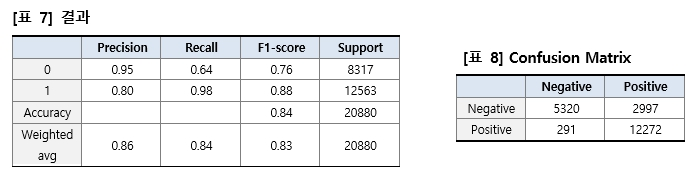
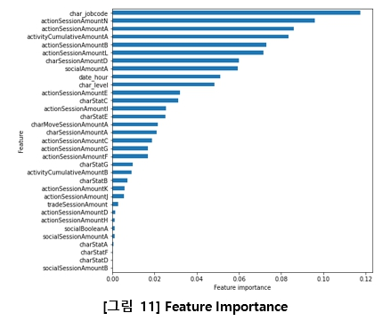
